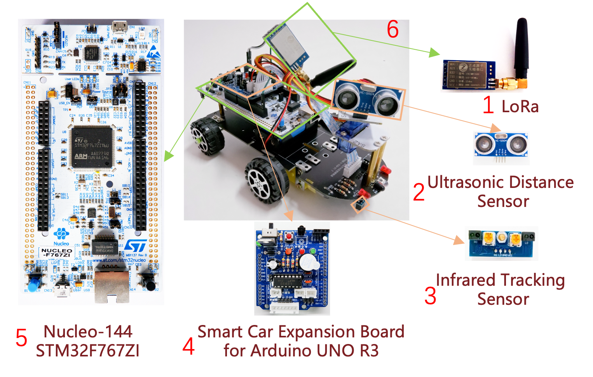
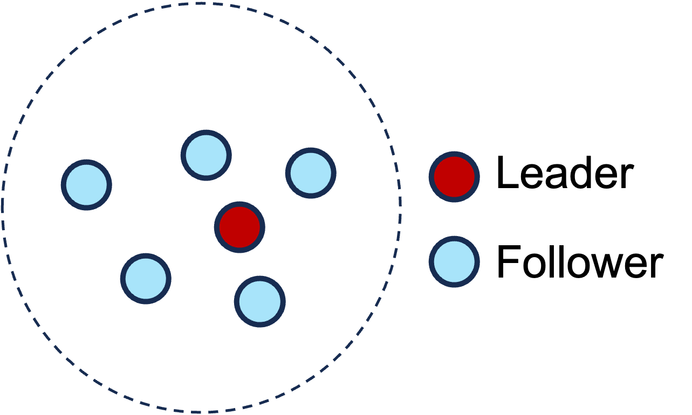
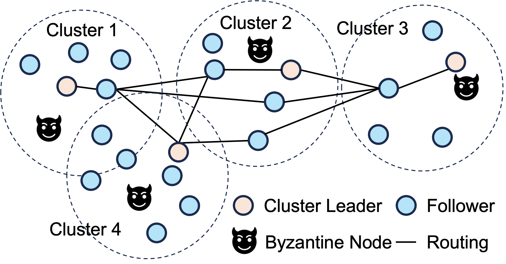

# SkyConsensus

This repository is for "Asynchronous BFT Consensus Made Wireless".

### Note

We provide implementations of three asynchronous BFT consensus protocols—HoneyBadgerBFT [1], BEAT [2], and Dumbo [3]—for wireless networks. Based on two asynchronous Byzantine agreement protocols (ABA) implementations, namely Bracha's ABA [4] using a local coin (LC) and Cachin's ABA [5] using a shared coin (SC), HoneyBadgerBFT and Dumbo each offer two variants: HoneyBadgerBFT-SC, HoneyBadgerBFT-LC, Dumbo-SC, and Dumbo-LC. In total, we provide five consensus protocols.

The **Consensus** directory contains the implementations of these five consensus algorithms, with separate subdirectories for single-hop and multi-hop network architectures. The **Wireless** directory includes the baseline consensus algorithms for wireless networks, which do not incorporate our optimization strategies, and it provides implementations for both single-hop and multi-hop networks.

The **Consensus Component** directory includes two categories of consensus components: broadcast protocols and ABA. For ABA, we provide implementations for both parallel and serial scenarios of Bracha's ABA and Cachin's ABA. Additionally, we offer an optimized version of Cachin's ABA in the parallel scenario by replacing threshold signatures with threshold coin flipping. For broadcast protocols, we provide reliable broadcast protocols (RBC), provable reliable broadcast protocols (PRBC), and consistent broadcast protocols (CBC). Optimized versions of RBC and CBC, namely RBC-small and CBC-small, are also available for scenarios with small broadcast values.

The **Crypto Tools** directory provides fundamental cryptographic components, including digital signatures, threshold encryption, threshold signatures, and threshold coin flipping.

> [1]A. Miller, Y. Xia, K. Croman, E. Shi, and D. Song, “The honey badger
> of bft protocols,” in Proceedings of the 2016 ACM SIGSAC conference
> on computer and communications security, 2016, pp. 31–42.
> 
> [2] S. Duan, M. K. Reiter, and H. Zhang, “Beat: Asynchronous bft made
> practical,” in Proceedings of the 2018 ACM SIGSAC Conference on
> Computer and Communications Security, 2018, pp. 2028–2041.
> 
> [3] B. Guo, Z. Lu, Q. Tang, J. Xu, and Z. Zhang, “Dumbo: Faster
> asynchronous bft protocols,” in Proceedings of the 2020 ACM SIGSAC
> Conference on Computer and Communications Security, 2020, pp. 803–
> 818.
> 
> [4]G. Bracha, “An asynchronous [(n-1)/3]-resilient consensus protocol,”
> in Proceedings of the third annual ACM symposium on Principles of
> distributed computing, 1984, pp. 154–162.
> 
> [5] C. Cachin, K. Kursawe, and V. Shoup, “Random oracles in constantipole:
> practical asynchronous byzantine agreement using cryptography,” in
> Proceedings of the nineteenth annual ACM symposium on Principles
> of distributed computing, 2000, pp. 123–132.

### Prerequisites

We provide a Keil project for each consensus algorithm.

Keil version: [5.36](https://developer.arm.com/Tools%20and%20Software/Keil%20MDK)

Operating System: [FreeRTOS](https://www.freertos.org/index.html)

##### Smart Car



1. **LoRa:** This is the main communication device, with a communication range of up to 6 kilometers with a 3dBi gain antenna.
  
2. **Ultrasonic Distance Sensor(optional):** A sensor that measures the distance between the car and obstacles.
  
3. **Infrared Tracking Sensor(optional):** Infrared tracking sensors are used to follow lines or edges.
  
4. **Smart Car Expansion Board for Arduino UNO R3:** The smart car expansion board is used to connect the sensors and other components of the car to the development board.
  
5. **Nucleo-144 STM32F767ZI:** The Nucleo-144 STM32F767ZI is a powerful development board that is well-suited for running consensus algorithms. Pin connections for other types of development boards need to be connected according to the development board pin diagram.
  
6. **Smart Car:** The effect picture after the smart car is assembled.
  

2 and 3 are shown as two basic sensors, and other requirements need to be changed according to the application scenario.

##### Only Consensus Test

If you are only testing the consensus algorithm, you only need LoRa and the development board. Pin connection relationship between LoRa and the development board (we use serial port 3 to connect to LoRa)

The specific pin connection relationship between LoRa and the development board will depend on the specific development board you are using.

| LoRa | MD0 | AUX | RXD | TXD | GND | VCC |
| --- | --- | --- | --- | --- | --- | --- |
| **Nucleo-144 STM32F767ZI** | **PG0** | **PE15** | **PB10** | **PB11** | **GND** | **5V** |

Note: Pins PB10 and PB11 should be set to AF7 alternate function.

### Run

We evaluate the performance of consensus algorithms in both single-hop and multi-hop network deployments.

#### Note

To modify the global configuration variables, follow the instructions below:

- The variable `Proposal_Size` is used to configure the size of a node's proposal. Note that `Block_Num`, which indicates the number of packets required for the proposal, must be calculated based on the size of the LoRa data packets being used.
  
- To modify the LoRa channel settings:
  
  - Update the `init()` function in the `main.c` file.
- The programs utilize Carrier Sense Multiple Access (CSMA) for communication.
  
  - TIM2 is used as a timer to measure program execution time.
  - TIM5 is designated as a timeout timer.

#### Single-Hop

The communication distance between any two nodes should not exceed a single hop, as depicted in the diagram below.



In a single-hop architecture, all nodes share the same channel. To reduce congestion in the future, we will consider implementing multiple channels.

To modify the global configuration variables in the `ABA_shared.h` file, please follow these instructions:

1. `Nodes_N`:
  
  - This variable specifies the total number of nodes in the network. Update it to reflect the desired total node count.
2. `Nodes_f`:
  
  - This variable determines the number of Byzantine nodes that can be tolerated. Ensure it aligns with the system's fault tolerance requirements.
3. `ID`:
  
  - Set this variable to the unique identifier for the node. Each node in the network must have a distinct `Nodes_f`.
4. `MAX_Nodes`:
  
  - This variable defines the maximum number of nodes the network can support. It must be set to a value greater than or equal to `Nodes_N`.
5. `MAX_ABA`:
  
  - This variable represents the maximum number of ABA instances the system can handle. Ensure it is set to a value greater than or equal to `Nodes_N`.

Note: The current implementation supports up to 8 nodes in a single-hop network. If more nodes are required, ensure all related configurations and hardware limitations are addressed accordingly.

```
#define Nodes_N 4
#define Nodes_f 1
#define ID 4
#define MAX_Nodes 20
#define MAX_ABA 20
```

#### Multi-Hop

As shown in the diagram for a multi-hop network deployment, all cluster leaders must be able to communicate within a single-hop distance. In future work, we will integrate a routing protocol. Apart from leader nodes, followers from different clusters should not communicate within a single-hop distance.



The currently provided multi-hop network code supports 16 nodes.

Due to the extensive communication range of LoRa, building a multi-hop network can be challenging, especially when attempting to create a static network. For the sake of convenience in testing, we provide an alternative method to build a multi-hop network by channel switching. In this approach, different clusters use different channels to avoid interference between them. After local consensus is achieved within each cluster, all leaders switch to the same channel to perform global consensus.

To configure the cluster-specific variables in the `ABA_shared.h` file, follow these instructions:

1. `Nodes_N`:
  
  - This variable represents the total number of nodes within a cluster. Update it to reflect the desired number of nodes in the specific cluster.
2. `Nodes_f`:
  
  - This variable specifies the maximum number of Byzantine nodes that can be tolerated within the cluster. Set this based on the cluster's fault tolerance requirements.
3. `ID`:
  
  - This is the unique identifier for a node within the cluster. Each node in the cluster must have a distinct `ID`.
4. `Group_ID`:
  
  - This variable identifies the cluster itself. Each cluster in the multi-hop network must have a unique `Group_ID` to differentiate it from other clusters.
5. `Global_channel`:
  
  - This variable specifies the communication channel used for global consensus. Set it to the designated channel for inter-cluster communication in the global consensus phase.

In this paper, the ID and Group_ID are configured as follows: Group_ID is set from 1 to 4, and the ID within each cluster is set from 1 to 4.

```
#define Nodes_N       4    // Total nodes in the cluster
#define Nodes_f       1    // Byzantine nodes tolerated
#define ID            1    // Node's unique ID within the cluster
#define Group_ID      1    // Cluster's unique identifier
#define Global_channel 5   // Channel for global consensus
```

The channel used within the cluster is Group_ID*10.
